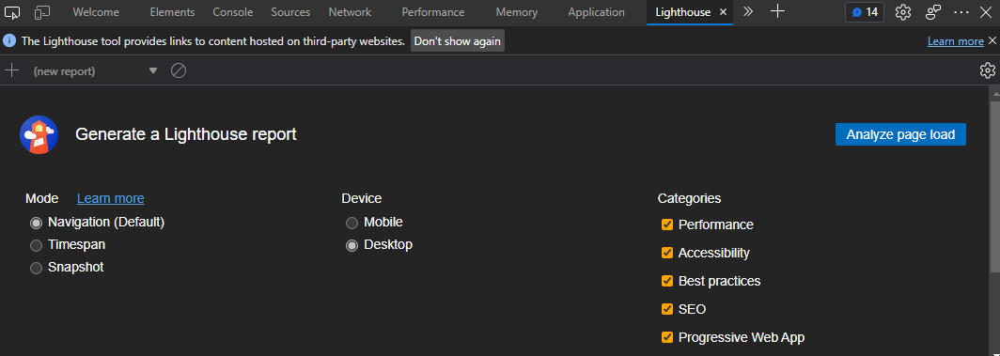
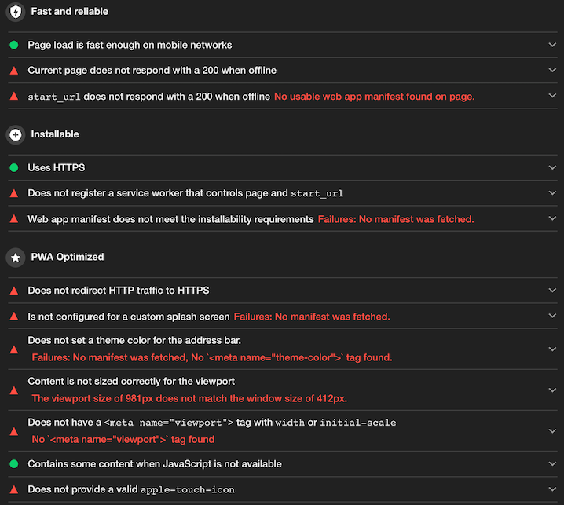
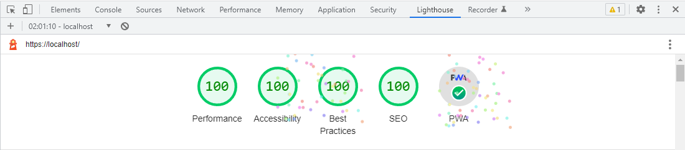
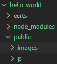
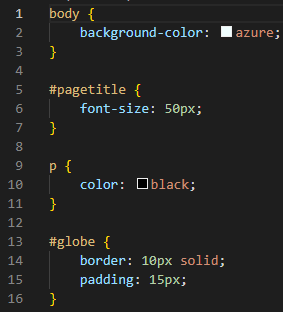
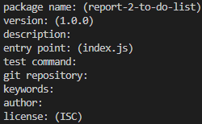
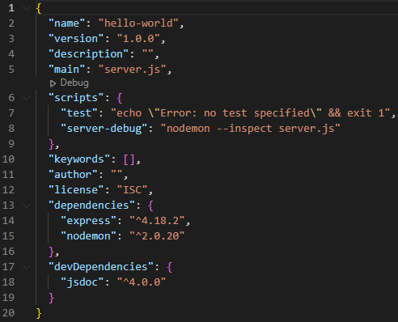
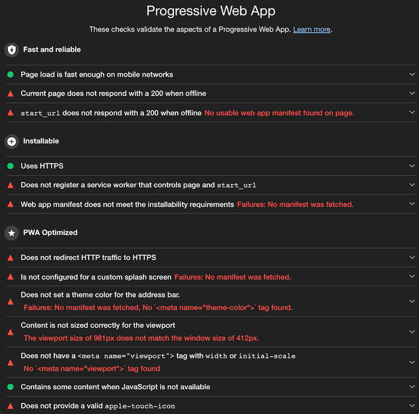
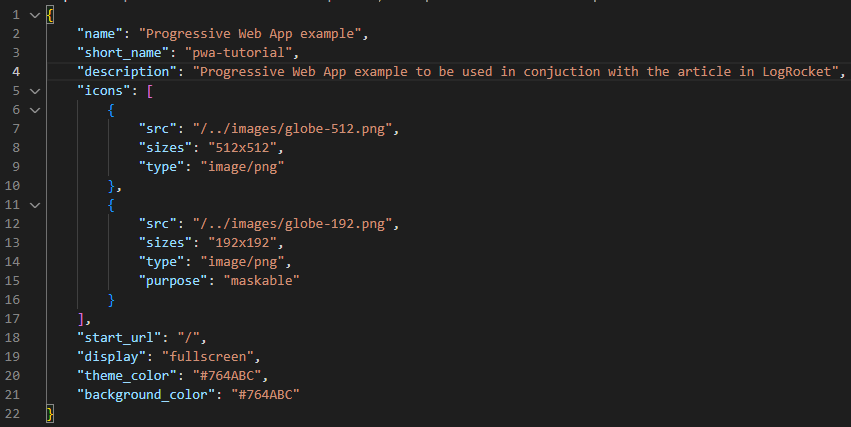

# **Progressive Web Applications and Developing an Example Offline Web Application**

# Abstract

HyperText Markup Language (HTML) has been the standard language for web-based documents since 2000 and it has been used to create all kinds of web applications since with the latest version, HTML5, being released in 2014. For websites and applications on the world wide web (WWW), the user would have to have an internet connection to access them. The new concept of a progressive web app (PWA) reduces this dependency on a stable internet connection as the standards for a PWA includes the requirement that it be accessible offline. In 2018, Google released Google Lighthouse which allowed developers to test web applications for compliance with standards and best practices.

# 1. Introduction

PWAs are a relatively new concept and are commonly used for offline applications due to their ability to be published online but also installed to a user's device without the need for an application distribution such as the iOS App Store or the Google Play Store without compromising on functionality or security. A PWA also has to adhere to 8 key principles, some of which are crucial in the development of an offline web application.

This report will discuss some of these principles and how they are important to the development of such an application as well as an overview of the steps involved. The development of an example "Hello World" PWA will then be documented with the technologies used and how the application aligns with the PWA criteria using Google Lighthouse.

# 2. PWAs

## 2.1. Relevance of PWAs in this Project

PWAs have a set of 8 key principles which should be observed to identify as one, however, this report will focus on the most relevant to making a simple offline web application.

The application should be 'installable' which means that it can be downloaded to a device and easily accessed from the user's home screen/desktop which is important when being used on mobile devices as it reduces the time needed to access the application.

PWAs should also be 'responsively designed' and 'progressively enhanced' so that the user interface (UI) will fit on any screen whether it be a mobile phone, tablet or desktop and the application has its core features available on all platforms with the advanced/unique features being available on more heavily supported ones.

The last principle is 'network independence' which is the application's ability to function in poor network conditions. An app is perceived to have this quality if:

* The user can revisit the app without a network connection.
* The user can browse any previously viewed content even in poor network conditions.
* The app can control what is shown to the user when there is no network connection.

## 2.2. Steps Required to Develop a PWA

PWAs are relatively simple to develop with tools available to assist developers during the whole process. The development of a PWA begins by creating an online local version of the web application while ensuring that it is 'responsively designed'. Once the developer has completed the app shell, they may build and run the application locally in the browser of their choice (except Firefox). They would then be able to inspect the page and utilise the Lighthouse tab to analyse their webapp.

Once the analysis has been complete, they will be shown the websites score in specific categories (Performance, Accessibility, Best Practices and Search Engine Optimisation) as well as showing whether the application passes the criteria (displayed below) needed for a PWA.


A PWA that has passed all these criteria will be shown this (below).


# 3. Developing the Example Application

The example "Hello World" application tries to implement some of the key principles described above while using Google Lighthouse to ensure that it passes all the necessary technical requirements for a PWA.

## 3.1. Technologies used

The following technologies were used in the example application.

| Type                       | Technology    |
| -------------------------- | ------------- |
| Version Control System     | Git           |
| App Server                 | NodeJS        |
| HTTP Server                | ExpressJS     |
| Debugging Tool             | Nodemon       |
| Test Browser               | Google Chrome |
| HTTPS Certificate Creation | OpenSSL       |
| Documentation              | JSDoc         |

## 3.2. Development

The development of the example application followed this tutorial (logrocket) and showed the network status of the application with an additional image of a globe and some basic CSS applied

### 3.2.1 Project Structure

The project structure was initially as follows.



| Directory      | Purpose                                                                                |
| -------------- | -------------------------------------------------------------------------------------- |
| hello-world    | Act as main project directory                                                          |
| /certs         | Contain SSL files                                                                      |
| /node_modules  | Contain files made during dependency installation                                      |
| /public        | Act as entry point for application                                                     |
| /public/images | Contain images required by application<br />Contain icons needed for conversion to PWA |
| /public/js     | Contain JS files                                                                       |

### 3.2.2 Designing the Web Page

The content of the web page is shown in index.html. Here are the parts of the code relevant to this stage of development.

```html
<head>
    <title>Hello World</title>
    <link rel="stylesheet" href="style.css">
    <h1 id="pagetitle">Offline 'Hello World' web application</h1>
</head>
<body>
    <span>You are now</span> <span><b class="page-status">online</b></span>
    <p id="imgcaption">Here's an image</p>
    
    <script src="/js/status.js"></script>
</body>
```

This code creates a webpage which has the title 'Hello World' and the main heading giving the name of the application. It also applies the styling from style.css shown below.



The body of the web page displays the network status of the application alongside a bordered image. The network status is changed by the status.js file which changes the text if the network is offline.

### 3.2.3 Developing Locally Ran Application

The next stage of the project involved implementing the functionality of the application and creating a local server for the application. This began with generating the package.json file by running `npm init` in the command line and then filling out the questions. Both are shown below.



ExpressJS was then installed as the HTTP server with nodemon as the debugger using `npm install express nodemon` in the command line. However, to set up Nodemon correctly, an additional line `"server-debug": "nodemon --inspect server.js"` was added to the package.json file (above). The server.js file (below) acts as the main server for the application and deals with the requests with the port 80 sent to the localhost address. The lines 10-12 directs the user to the main page when they type in localhost in their browser:

```javascript
const express = require('express')
const path = require('path')

const httpPort = 80

const app = express()

app.use(express.static(path.join(__dirname, 'public')))

app.get('/', function(req, res) {
  res.sendFile(path.join(__dirname, 'public/index.html'))
})

app.listen(httpPort, function () {
  console.log(`Listening on port ${httpPort}!`)
})
```

Now, when the user was to run `npm start` in the command line, the user would be able to see the main page when they go to localhost in their browser. If they were to run the Lighthouse Audit on this application they would see a similar result to this (below).



As seen, they are plenty of criteria that are not satisfied for the application to be classified as a PWA.

### 3.2.4 Completing Required Steps for a PWA

To satisfy these criteria, it is easy to group them by what they require. For example, under the PWA optimisation subheading, the following are seen:

* Does not set a theme colour for the address bar.
* Content is not sized correctly for the viewport.
* Does not have a `<meta name="viewport">` tag with `width` or `initial-scale`.

These can all be satisfied by making changes within the index.html file and adding the following lines which set the theme colour and scale the content for the device being used.

```html
<meta name="viewport" content="width=device-width, initial-scale=1">
<meta name="theme-color" content="#764ABC">
```

The next set of criteria focus on the implementation of a webmanifest which stores the details required for the installation of the PWA on a device. This includes: the name of the app, a short name (optional), description, any icons which will be used to display the app on the home screen/desktop of the device the app is installed on, the start_url, the type of display the app will take, and the global theme/background colour. This file should look something like this (below).



This file would then have to be linked within the index.html file with the line `<linkrel="manifest"href="js/pwa.webmanifest">` to apply these changes. They would then have to add an additional line to the index.html file to declare the add-to-home-screen (AHS)/apple touch icon.

The application would then have to be served by HTTPS to be validated as a PWA as well as to register a service worker (SW) which allows the application to work offline. To do this, a self-signed certificate would have to be created as well as ensuring that all requests to the application would always be over HTTPS instead of HTTP. To do this, the following commands would have to be ran in an administator-approved command line.

```
// Create RSA-2048 key with password
openssl genrsa -des3 -out rootCA.key 2048

// Create root certificate (Requires optional information)
openssl req -x509 -new -nodes -key rootCA.key -sha256 -days 1460 -out rootCA.pem

// Trust certificate locally
certutil -addstore -f "ROOT" rootCA.pem
```

After this is done, an OpenSSL configuration file and a v3.ext file need to be made in order to run the following code:

```
// Create a private key and certificate-signing request (CSR) for the localhost certificate.
openssl req -new -sha256 -nodes -out server.csr -newkey rsa:2048 -keyout server.key -config server.csr.cnf

// Issues a certificate via the root SSL certificate and the CSR
openssl x509 -req -in server.csr -CA rootCA.pem -CAkey rootCA.key -CAcreateserial -out server.crt -days 500 -sha256 -extfile v3.ext
```

The server.js file would then have to be updated in order to reflect this. A new file pwa.js would then finally be able to register the SW by adding implementing this function:

```javascript
function init() {
  if ('serviceWorker' in navigator) {
    navigator.serviceWorker.register('/sw.js')
      .then((reg) => {
        console.log('Service worker registered -->', reg);
      }, (err) => {
        console.error('Service worker not registered -->', err);
      });
  }
}
```

You would then have to assign this script to index.html by adding another `<script>` element: `<scriptsrc="js/pwa.js"></script>`. The last step is to write the code for the SW which includes: assigning files to be added to the cache, registering the sw and adding the files to the cache, updating the cache everytime the website is accessed while online, fetching requests from cache or network depending on the user's connection.

### 3.2.5 Deploying the Web Application

At this point the application is ready to be tested a final time. However, if the server is ran and tested on the browser, the SW would likely come up with a registration error as the certificate is self signed which means it would not be trusted by most web browsers. To avoid this Chrome would have to be ran with the following command:

```powershell
chrome.exe --ignore-certificate-errors --unsafely-treat-insecure-origin-as-secure=https://localhost:443
```

This command runs Chrome in a way in which it will ignore this error and register the SW as normal.

## 4. References

[Introduction to progressive web apps - Progressive web apps (PWAs) | MDN (mozilla.org)](https://developer.mozilla.org/en-US/docs/Web/Progressive_web_apps/Introduction#:~:text=An%20app%20could%20be%20considered,app%20is%2C%20such%20as%20Lighthouse.)

[How to build a progressive web app (PWA) with Node.js - LogRocket Blog](https://blog.logrocket.com/how-to-build-a-progressive-web-app-pwa-with-node-js/)

[How to Create Trusted Self-Signed SSL Certificates and Local Domains for Testing](https://betterprogramming.pub/trusted-self-signed-certificate-and-local-domains-for-testing-7c6e6e3f9548)
